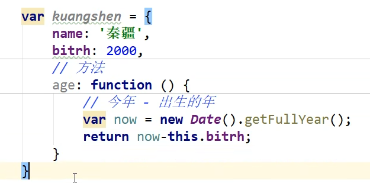

# JavaScript


## 快速入门
### 1. 引入

- 内部标签使用
```html
<script>
    .....
</script>
```
- 外部引入使用 **一定使用双标签，不要使用单标签（可能出问题）**
```javascript
<script src="https://cdn.bootcss.com/jquery/3.2.1/jquery.min.js"></script>
```

### 2. 变量与数据类型
用Java的语法去写保证没问题，JavaScript严格区分大小写。
- number JavaScript不区分小数和整数。 `123` `123.2` 浮点数会有精度损失。 
- string `'abc'` `"abc"`
- boolean `true` `false`
- 与或非 `&&` `||` `!`
- 赋值： `=` 等于（类型不一样，值一样也会判断为true）：`==` 绝对等于（类型一样，值一样会判断为true）：`===`
- NaN `NaN` 只能通过 `isNaN()` 判断
- null `null` 空
- undefined `undefined` 未定义
- 数组 `[1, 2, 3, 'hello', true, null, undefined]` 索引从0开始, 索引越界会返回undefined
- 对象 `{name: 'hello', age: 18}`

```javascript
var person = {name: 'hello', 
              age: 18
              target: [1, 2, 3]
              }
```

### 3. 严格检查模式
`'use strict';` 严格检查模式，放在第一行。

## 数据类型

1. 字符串

```javascript
模板字符串：
var name = 'hello';
var age = 18;
var info = `my name is ${name}, age is ${age}`;

字符串长度：
var name = 'hello';
var length = name.length;

大小写转换：
var name = 'hello';
var upperName = name.toUpperCase();
var lowerName = name.toLowerCase();

获取索引：
var name = 'hello';
var index = name.indexOf('l');

获取子串：
var name = 'hello';
var subName = name.substring(1, 3); // [1, 3)
```

2. 数组 
Array可以存放任意数据类型。

```javascript
示例：
var arr = [1, 2, 3, 'hello', true, null, undefined];

获取数组长度：
var arr = [1, 2, 3, 'hello', true, null, undefined];
var length = arr.length;

如果给 arr.length赋值，数组长度会改变。如果赋值过小，数组会丢失，如果赋值过大，数组会扩展。

获取数组元素：
var arr = [1, 2, 3, 'hello', true, null, undefined];
var element = arr[0];
var element = arr[arr.length - 1];

获取下标索引：
var arr = [1, 2, 3, 'hello', true, null, undefined];
var index = arr.indexOf(3);

添加元素：
var arr = [1, 2, 3, 'hello', true, null, undefined];
arr.push(4); // 添加元素到尾部
arr.pop(); // 删除末尾的一个元素
arr.unshift('a', 'b'); // 添加元素到头部
arr.shift(); // 删除头部一个元素

截取数组（返回一个新的数组 类似于String中的substring）：
var arr = [1, 2, 3, 'hello', true, null, undefined];
var newArr = arr.slice(1, 3);
var newArr = arr.slice(1);

数组排序：
var arr = ['A', 'B', 'C'];
arr.sort();

元素翻转：
var arr = ['A', 'B', 'C'];
arr.reverse();

删除数组元素：
var arr = [1, 2, 3, 'hello', true, null, undefined];
arr.splice(1, 2);
arr.splice(1, 0, 'a', 'b');

拼接数组（会返回一个新的数组 不改变原数组）：
var arr = [1, 2, 3];
var newArr = arr.concat([4, 5, 6]);

连接符（使用特定的字符串符接数组元素）：
var arr = [1, 2, 3];
var str = arr.join('-');

多维数组：
var arr = [
    [1, 2, 3],
    [4, 5, 6],
    [7, 8, 9]
]

获取多维数组元素：
var element = arr[1][1]; // 5

遍历数组：
for (var i = 0; i < arr.length; i++) {
    console.log(arr[i]);
}

遍历多维数组：
for (var i = 0; i < arr.length; i++) {
    for (var j = 0; j < arr[i].length; j++) {
        console.log(arr[i][j]);
    }
}
```

3. 对象

**JavaScript中键都是字符串，值可以是任意类型**

```javascript
示例：
var person = {name: 'hello',
              age: 18
              };

获取对象属性：
person.name // hello
person['name'] // hello
person.haha // undefined 使用键值访问属性时，如果键值不存在，会返回undefined

添加对象属性：
person.haha = 'haha';
person['haha'] = 'haha';

删除对象属性：
delete person.name; 
delete person['name'];

遍历对象：
for (var key in person) {
    console.log(key, person[key]);
}

判断属性是否存在：
if ('name' in person) {
    console.log('存在');
}

判断这个属性是否是对象自身拥有的属性：
if (person.hasOwnProperty('name')) {
    console.log('是');
}
```

4. Map和Set

Map和Set都是ES6新增的集合类型。Map和对象最大的区别是：对象键只能是字符串，Map键可以是任意类型。Set集合中不能有重复的元素，Map集合中可以有重复的元素。
```javascript
1. Map // 键值对
var map = new Map();
map.set('name', 'hello');
map.set(1, 'world');
map.set(true, 'haha');
map.set(null, 'null');
map.set(undefined, 'undefined');

通过key获取value：
map.set('hello'); // hello

设置键值对：
map.set("name", "Tom"); 

2. Set // 无序不重复集合
var set = new Set(); // set可以去重

添加元素：
set.add('hello');
set.add(1);

删除元素：
set.delete('hello');
set.delete(1);

是否包含某个元素：
if (set.has('hello')) {
    console.log('包含');
}
```

## 流程控制

直接上例子：
```javascript
var age = 18;
if (age >= 18) {
    console.log('可以投票');
} else if (age < 30) {
    console.log('可以投2票');
} else {
    console.log('不可以投票');
}

while (age < 100) {
    age++;
    console.log(age); // while循环会先判断条件再执行代码
}

do {
    age++;
    console.log(age);
} while (age < 100); // do while循环至少会执行一次  


for (var i = 0; i < 10; i++) {
    console.log(i);
}

foreach循环：
var arr = [1, 2, 3, 4, 5];
arr.forEach(function (element, index, arr) {
    console.log(element, index, arr);
})

for-in循环：
var person = {
    name: 'hello',
    age: 18
        };
for (var key in person) { 
    // for-in是下标 for-of是值 迭代尽量都用for-of
        console.log(key, person[key]);
        // key为索引，person[key]为值
    }


switch (age) {
    case 18:
        console.log('可以投票');
        break;
    case 30:
        console.log('可以投2票');
        break;
    default:
        console.log('不可以投票');
        break;
}
```

### Iterator和 Generator

```javascript
1. Iterator // 迭代器
var arr = [1, 2, 3];
var iterator = arr[Symbol.iterator]();
```


## 函数 没讲清楚有点问题 下来再找点知识看看
JavaScript可以传任意个参数，也可以忽略参数。`arguments`对象可以获取函数传递进来的参数。

```javascript
1. 定义函数
function add(a, b) {
    return a + b;
}

var add = function (a, b) {
    return a + b;
}
```

### 变量的作用域
JavaScript中变量的作用域是函数作用域。函数内部定义的变量，只在函数内部有效。函数外部定义的变量，可以在函数内部访问。函数内部定义的变量，会覆盖函数外部定义的变量。尽量用`let`， 避免使用`var`。常量：`const`，不能被修改。

### 方法
第一种方式：
```javascript
var person = {
    name: 'hello',
    age: 18,
    say: function () {
        console.log(this.name); // this指向person
    }
}

person.name // 属性=person.say(); // 方法
```

::: warning `this`关键字的用法
可以把它当做Java中的this使用 `this`指向的是当前对象(使用它的人)。在JavaScript中可以改变`this`指向。 
:::


第二种方式：
```javascript

function getAge() {
    return this.age;
}

var person = {
    name: 'hello',
    age: getAge,
    }

getAge.apply(person, []); // this 指向 person, 参数为空
```

### 闭包
待补充

### Date

```javascript
var date = new Date();
data.getFullYear(); // 获取年份
data.getMonth(); // 获取月份
data.getDate(); // 获取日期
data.getDay(); // 获取星期几
data.getHours(); // 获取小时
data.getTime(); // 获取时间戳
```

### JSON
在JavaScript中一切都是对象，任何JavaScript支持的类型都可以转为JSON。`JSON.stringify()`可以将对象转为JSON字符串。`JSON.parse()`可以将JSON字符串转为对象。

## 面向对象编程

- 面向对象原型模式：创建对象实例时，会先创建一个原型对象，然后基于原型对象创建对象实例。
- 面向对象class模式：创建对象实例时，会先创建一个类，然后基于类创建对象实例。（ES6开始支持）

```javascript
// 类
class Person {
    constructor(name, age) {
        this.name = name;
        this.age = age;
    }
 
    sayHello() {
        console.log('hello');
    }
}

var person = new Person('hello', 18);

// 继承
class Student extends Person {
    constructor(name, age, grade) {
        super(name, age);
        this.grade = grade;
    }
    study() {
        console.log('study');
    }
}
```
> 原型链：对象实例会创建一个__proto__属性，这个属性指向对象实例的构造函数的原型对象。


## JavaScript DOM
DOM是Document Object Model的缩写，即文档对象模型。DOM是HTML和XML文档的编程接口。DOM允许JavaScript创建、修改和删除HTML元素。

### 操作DOM
- `window`: 代表浏览器窗口
- `Navigator`: 封装了浏览器信息（大多数时候不建议使用）
- `location`: 当前页面的URL信息
- `document`: 当前页面内容
- `history`: 浏览器历史记录（不建议使用 现在使用Ajax）

### 获取DOM
归结到底就是：增删改查

- `getElementById()`: 根据id获取元素
- `getElementsByClassName()`: 根据类名获取元素
- `getElementsByTagName()`: 根据标签名获取元素
- `querySelector()`: 根据选择器获取元素
- `querySelectorAll()`: 根据选择器获取元素
- `document.body`: 获取body元素

```javascript
获取元素：
var element = document.getElementById('name'); 
var elements = document.getElementsByClassName('name'); 
var elements = document.getElementsByTagName('div');

element.innerHTML; // 获取元素内容
var childrens = element.children; // 获取父元素下所有子元素
var parent = element.parentNode;  // 获取父元素
var next = element.nextSibling; // 获取下一个兄弟元素

修改元素：
element.innerText = 'hello'; // 修改元素内容
element.innerHTML = '<h1>hello</h1>'; // 修改元素内容(可以解析HTML标签)
element.style.color = 'red'; // 修改元素样式
element.className = 'name'; // 修改元素类名
element.setAttribute('id', 'name'); // 添加属性

删除元素(步骤：先获取父元素，然后通过父元素删除自己)：
// 删除多个节点的时候，childrens是在时刻变化的
element.removeChild(); // 删除

添加元素：
// 如果我们获得的DOM元素是空的，那么通过innerHTML就会添加一个元素，如果这个DOM已经存在元素，那么通过innerHTML就会替换（覆盖）这个元素。
element.appendChild(xxx); // 追加元素
element.insertBefore(newNode, targetNode); // 添加元素
document.createElement('div'); // 创建一个新的div元素

示例：
var element = document.createElement('div'); // 创建一个div元素
element.innerHTML = 'hello'; // 添加内容
element.id = 'name'; // 添加id属性

// 创建一个标签元素:
var script = document.createElement('script');
script.setAttribute('src', 'https://cdn.bootcdn.net/ajax/libs/jquery/3.5.1/jquery.min.js');
```

### 操作表单

```javascript
// 1. 对于单选框 多选框 复选框等等xxx.value只能获取固定的值
var element = document.getElementById('name');
element.value; // 获取值
element.checked; // 获取复选框是否选中(返回值为true/false)

// 2. 提交表单（加密）
```