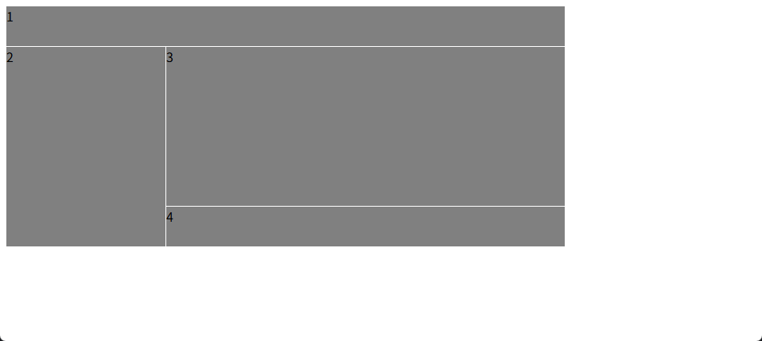

# 盒子模型和布局

## 盒子模型 <Badge type="warning" text="基本都不会继承" />

### 主要属性

盒子模型由内容区域、内边距、边框和外边距组成。如下图所示：


设置盒子的一些属性：<Badge type="danger" text="仅限内块元素和行内块元素 行内元素无效" />

### `width`: 宽度
可以写数值、百分比 默认宽度为`width: 100%`
  - `width: fit-content`: 宽度自适应内容宽度 
  - `width: min-content`: 宽度自适应内容最小宽度
  - `width: max-content`: 宽度自适应内容最大宽度
### `height`: 高度
和宽度一样
### `padding`: 内边距 会使盒子宽度和高度变大 <Badge type="info" text="上右下左" />
  - `padding-top`: 上内边距
  - `padding-right`: 右内边距
  - 给行内元素设置`padding`属性 左右生效 上下无效(实际是有效的但是不体现在上下边距)
### `margin`: 外边距 
用来控制元素外部与其他元素之间的距离 和内边距一样
- 边距展示 边距从内侧内容区域开始计算

- `margin: auto`: **只影响横向效果** 自动计算盒子两边距离父盒子边框的宽度，实现自动居中
:::danger margin折叠
1. **相邻的兄弟元素**: 相邻的块级兄弟元素，上面元素的 `margin-bottom` 和下面元素的 `margin-top` 会发生折叠。
2. **父元素和第一个子元素**: 如果父元素没有上边框、上内边距，并且没有内容将它和它的第一个子元素分开，那么父元素的 `margin-top` 和第一个子元素的 `margin-top` 会发生折叠。不过，针对这种情况来说，只要父盒子满足以下要求，就可以阻止折叠行为：
    - 父元素有 padding-top（哪怕是 1px）
    - 父元素有 border-top（哪怕是透明边框）
    - 父元素形成新的块格式化上下文（BFC，后续会介绍，比如设置overflow属性）
3. **空的块级元素**: 如果一个块级元素没有内容、`padding`、`border`，并且 `height` 为 `auto`，那么它自己的 m`argin-top` 和 `margin-bottom` 会发生折叠。
:::

### `border`: 边框 盒子边框会使盒子宽度和高度变大
  - `border-width`: 边框宽度 默认 `border-width: 1px`
  - `border-style`: 边框样式 默认 `border-style: none`
  - `border-color`: 边框颜色 默认 `border-color: black`
  - `border-radius`: 边框圆角 默认 `border-radius: 0px`

:::warning box-size
`box-sizing`: 盒子模型 
  - 默认 `box-sizing: content-box` 
  - `box-sizing: border-box`: 盒子模型为边框模型 盒子宽高等于内容宽高 + 内边距 + 边框宽度 设置这个只需要考虑宽度和高度
:::
可以合并，效果如下：
```css
.box {
    border: 1px solid blue;
}
```

### 背景 Background

- `background-color`: 背景颜色 
    - 默认: `background-color: transparent`
- `background-image: url(地址)`: 背景图片
- `background-size`: 背景图片大小 
    - `background-size: auto`：默认
    - `background-size: cover`：窄边优先
    - `background-size: contain`：宽边优先
- `background-repeat`: 背景图片重复
    - `background-repeat: repeat-x`:水平重复
    - `background-repeat: repeat-y`:垂直重复
- `background-position`: 背景图片位置
    - `background-position: center`: 居中
    - `background-position: left top`: 左上
    - `background-position: left bottom`: 左下

可以合并，效果如下：
```css
.box {
    background: red url(img/bg.png) no-repeat top left / 100px 100px;
}
```

### 用户代理样式
类似于默认样式 浏览器会为元素添加一些样式 不同浏览器的用户代理样式不一样，可能会导致网页的某些元素以不一样的尺寸或边距进行展示，从而出现不同用户看到的页面样式不同的情况。因此，一般需要消除浏览器的默认样式：在 https://www.jsdelivr.com 通过以下代码引入: 
```css
<link rel="stylesheet" href="https://cdn.jsdelivr.net/npm/normalize.css@8.0.1/normalize.min.css">
```

### 滚动区域
使用 `overflow` 属性设置滚动区域 滚动条会占用盒子的一部分空间
- `overflow: auto`:  默认值，浏览器会根据内容自动生成滚动条
- `overflow: scroll`: 始终生成滚动条
- `overflow: hidden`: 隐藏超出的内容(可用JS强制滚动)
- `overflow: clip`: 剪切超出的内容(不能用JS强制滚动)
::: info 
访问 https://caniuse.com 查询哪些CSS特性受支持
:::
针对x轴和y轴单独设置滚动条：
- `overflow-x: hidden`: 设置隐藏x轴滚动条
- `overflow-y: scroll`: 设置y轴滚动条


## 布局 <Badge type="danger" text="重要" />

### 定位布局

使用`position`设置盒子的布局 默认是static类型，也就是静态布局 

#### 相对定位

使用`position: relative`设置相对布局 

使用定位布局后，我们需要手动指定盒子上下左右的位置，使用left、right、top、bottom 虽然可以使用相对定位来移动盒子的位置，但是盒子所占据的大小和位置还是停留在本来的位置，只是视觉效果上发生了位移。

```css
.box {
    position: relative;
    left: 10px; /* 相对于自身原本位置 距离左边10px */
}
```

#### 绝对定位
使用`position: absolute`设置绝对布局

绝对定位的盒子会**脱离文档流**，不会占用空间，但是绝对定位的盒子的定位会基于**最近的非静态定位的父盒子**(position非static)。如果没有非静态定位的父盒子，那么绝对定位的盒子会基于**html/body**。**子绝父相**

当**html/body**存在滚动条时，绝对定位的盒子会一起随着滚动条滚动

:::info 脱离文档流
脱离文档流就是从页面常规的流中脱离，**不再占用页面的位置**，页面会重新计算空间。
:::

#### 固定定位
使用`position: fixed`设置固定定位

固定定位的盒子会**脱离文档流**，不会占用空间，但是默认固定定位的盒子会基于整个浏览器窗口。固定定位会一直固定在浏览器窗口的某个位置，不会随页面滚动而滚动。(页面中常驻元素可以使用：顶部导航栏、侧边栏、底部导航栏、广告)

#### 粘性定位
使用`position: sticky`设置粘性定位

自己尝试粘性定位的效果 粘性定位在文档中的位置会始终保留。

#### 包含块
参照物 参考系
- static/relative 最近的块级祖先元素(父盒子)
- absolute/fixed 最近的 position不为static的祖先元素(父盒子) 没有的话就以html/body为参照物
- fixed 始终是视口

#### Z轴顺序
Z轴决定谁盖在谁上面

`z-index: 1`: 默认值，元素在Z轴的顺序，值越大越靠前 必须是有定位的元素才有效果

####  层级上下文

层级上下文：一个独立的空间(分层空间) `z-index`只在同一个层级上下文中有效

什么时候会创建新的层级上下文？
- 盒子存在非`static`定位，且使用了`z-index`属性（即使是`z-index: 0`）此时盒子会创建一个新的层级上下文
- 盒子使用了`fixed`定位（即使没有`z-index`），会直接创建一个新的层级上下文
- 盒子使用了`sticky`定位且处于粘滞状态时，会创建一个新的层级上下文

### 网格布局

#### 基础布局设置

网格布局是一个二维布局系统，针对行列进行单独处理。

`display`属性可以改变显示模式：

- `display:inline`: 创建行内布局

- `display: block`: 创建块级布局

- `display: grid`: 创建网格布局 放入网格的盒子会自动设置为网格的宽高
  - `grid-template-columns:100px 100px 100px`: 定义列的数量：3列，每一列的宽度都是100px 
  - `grid-template-rows:100px 100px 100px`: 定义行的数量：3行，每一行的宽度都是100px
  - `fr`: 1份
  - `grid-template-columns:1fr 1fr 1fr`==`grid-template-columns:repeat(3, 1fr)`: 3列，每一列占1份
  - `gap: 10px`: 设置列间距和行间距为10px

实现自动扩列效果：
```css
.grid-box {
  display: grid;
  gap: 1px;
  /* 实现网格自动扩列效果 */
  grid-template-columns: repeat(auto-fill, minmax(200px, 1fr));
}
```
这里用到的东西有：

- minmax(200px, 1fr): 定义了每一列宽度的范围
  - **最小值 200px**: 每一列最窄不会小于 200 像素
  - **最大值 1fr**: fr 是“分数单位”（fraction unit）。1fr 表示如果还有剩余空间，该列会占满剩余空间
  - **含义**: 列宽至少是 200px；如果空间够大，它们会拉伸填满行宽。
- auto-fill: 这是一个智能关键字，不同于直接设置固定列数
  - 它告诉浏览器：**在不换行的情况下，尽可能多地往一行里塞入列**
  - 如果容器很宽，浏览器会计算：容器宽度 / 200px 能放下多少列，就生成多少列

 #### 显式网格和隐式网格

- **显式网格 (Explicit Grid)**： 由我们通过 `grid-template-columns` 和 `grid-template-rows` 手动定义好的格子区域（比如前 2 行）
- **隐式网格 (Implicit Grid)**： 当内容超出我们定义的网格范围或是只设置了横向或纵向的网格数时，浏览器会自动创建新的行来容纳这些内容，这就构成了隐式网格

  - `grid-auto-columns`: 定义了隐式网格的列宽
  - `grid-auto-rows`: 定义了隐式网格的行宽

实现效果：
```css
.grid-box {
  display: grid;
  gap: 10px;
  grid-template-columns: repeat(3, 1fr);
  grid-template-rows: repeat(2, 100px);
  grid-auto-rows: 80px;  /* 表示超出显式网格范围后，隐式网格高度按80px展示 */
}
```
  - `gird-auto-flow: column`: 控制网格按照什么方向去排列 默认为：row

#### 元素的定位与合并

通俗来说，类似于Excel的合并单元格

简写属性：
- `grid-column: 1 / 3`: 列从1开始，到3结束
- `grid-row: 1 / 3`: 行从1开始，到3结束
- `grid-row: span 2`: 横跨2行

#### 网格对齐

这里主要研究格子的对齐方式

- `justify-items`和`align-items`: 定义列（行）的对齐方式
- : 定义行的对齐方式
- `justfy-items: start/left/center/right/end`: 列(内容)居中/右对齐/右对齐
- `justify-self: end`: 设置其中某个单个元素的对齐方式
- `justify-content: center`: 列(盒子)居中
- `justify-content: space-between`: 列(盒子)两端对齐(调整gap) 优先用盒子填充两侧
- `justify-content: space-around`: 保证每个盒子两侧间隔相等
- `align-items: center`: 行(内容)居中


这里总结一下上面用到的几种对齐类型：

- `*-content`: 控制 **整个网格** 在容器内的对齐。在你定义的网格轨道（所有行和列）总尺寸小于容器尺寸时生效。
- `*-items`: 控制所有 **网格项（Item）** 在其所在的 **单元格（Cell）** 内的对齐。
- `*-self`: 控制某一个 **网格项（Item）** 在其所在的 **单元格（Cell）** 内的对齐。

对齐一般用于网格内元素小于单元格大小，以及网格整体排列等情况，在大部分情况下很少会用到。

#### 网格区域

`grid-template-areas: ` 用来画出页面布局 **语义化极强** 但是更推荐使用弹性布局

具体代码示例如下：
```html
<!doctype html>
<html lang="zh">
<head>
  <meta charset="UTF-8">
  <meta name="viewport"
        content="width=device-width, user-scalable=no, initial-scale=1.0, maximum-scale=1.0, minimum-scale=1.0">
  <meta http-equiv="X-UA-Compatible" content="ie=edge">
  <link rel="stylesheet" href="./CSS-1.css">
  <title>Document</title>
</head>
<body>
  <div class="grid-box">
    <div class="grid-item header">1</div>
    <div class="grid-item nav">2</div>
    <div class="grid-item content">3</div>
    <div class="grid-item footer">4</div>
  </div>
</body>
</html>
```

```css
.grid-box {
    display: grid;
    gap: 1px;
    grid-template-columns: 200px 250px 250px;
    grid-template-rows: 50px 200px 50px;

    grid-template-areas:
    "header header header"
    "aside main main"
    "aside footer footer";
}

.grid-item {
    background-color: grey;
}

.header {
    grid-area: header;
}

.nav {
grid-area: aside;
}

.content {
    grid-area: main;
}

.footer {
    grid-area: footer;
}
```
实现效果如下:



### 弹性布局 <Badge type="danger" text="重要"/> <Badge type="danger" text="90%可用"/>

弹性布局的实现原理是：浏览器会根据弹性布局的属性来计算元素尺寸，并自动调整元素尺寸，使其适应浏览器窗口大小。弹性布局的盒子会线性排列，无论是块级元素还是行级元素。弹性布局允许元素在浏览器窗口大小改变时自动调整大小，**在空间不足的时候可让盒子自动收缩**。
- `display: flex`: 创建弹性布局
- `flex-direction: row/column`: 定义布局方向
- `flex-wrap: nowrap/wrap/wrap-reverse`: 默认`nowrap`:不换行 `wrap`:换行 `wrap-reverse`:换行并倒序显示 **响应式使用的比较多**

#### 对齐方式 <Badge type="info" text="多数属性与网格布局类似"/>

- **主轴**：默认从左往右
- **交叉轴**：与主轴垂直
- `flex-direction: row`: (默认)主轴方向(从左往右)
- `flex-direction: row-reverse`: 改变主轴方向(从右往左)
- `flex-direction: column`: 改变主轴方向(从上到下)
- `flex-direction: column-reverse`: 改变主轴方向(从下到上)
- 在flex布局中，`justify-item`和`justify-self`属性无效
- `justify-content: flex-start/flex-end/center/space-between/space-around`: 主轴对齐方式
- `align-items: flex-start/flex-end/center/baseline/stretch`: 交叉轴对齐方式

#### 空间分配
- **在每个盒子元素中设置**，而非弹性布局中设置
- `flex-grow: 0`: 所有盒子不放大（默认 **0**） 1: 所有盒子等比例放大 2: 单独控制某一个与剩余盒子比例不同
- `flex-shrink: 1`: 所有盒子等比例缩小（默认 **1**） 0: 不缩小 2: 单独控制某一个与剩余盒子比例不同
- `flex-basis: auto`: 盒子的初始大小（默认 **auto**） 一般为auto
简写属性：
- `flex: 0 1 auto`(默认值)等价于`flex-grow: 0` `flex-shrink: 1` `flex-basis: auto` 不放大，会缩小，大小由内容决定。
- `flex: 1`是 `flex: 1 1 0%`;的简写。意思是：会放大，会缩小，基础大小为0。这常用于让项目等分容器。
- `flex: auto`是 `flex: 1 1 auto`的简写。
- `flex: none`是 `flex: 0 0 auto`的简写。不放大也不缩小。

实现网格布局的效果：
```html
<!doctype html>
<html lang="zh">
<head>
  <meta charset="UTF-8">
  <meta name="viewport"
        content="width=device-width, user-scalable=no, initial-scale=1.0, maximum-scale=1.0, minimum-scale=1.0">
  <meta http-equiv="X-UA-Compatible" content="ie=edge">
  <link rel="stylesheet" href="./CSS-1.css">
  <title>Document</title>
</head>
<body>
  <div class="flex-box">
    <div class="header">
header
    </div>
    <div class="nav">
      <div class="aside">aside</div>
      <div class="content">
        <div class="main">main</div>
        <div class="footer">footer</div>
      </div>
    </div>
  </div>
</body>
</html>
```

```css
.flex-box {
    display: flex;
    flex-direction: column;
    width: 800px;
    height: 600px;
    .header {
        background-color: blue;
        width: 100%;
        height: 10%;
    }

    .nav{
        flex: 1;
        background-color: yellow;
        flex-direction: row;
        display: flex;
        .aside {
            background-color: darkgoldenrod;
            width: 30%;
            height: 100%;
        }
        .content {
            flex: 1;
            display: flex;
            background-color: rosybrown;
            flex-direction: column;
            .main {
                width: 100%;
                height: 90%;
                background-color: rebeccapurple;
            }
            .footer {
                flex: 1;
                background-color: salmon;
            }
        }
    }
}
```


### 浮动布局 <Badge type="warning" text="已过时"/>

- 浮动布局让一个元素脱离文档流，并移动到父容器左侧或右侧，直到遇到父容器的边缘和另一个浮动元素为止。
- 使用`float: left/right`设置浮动布局 类似效果：**图文环绕**
- 浮动布局会导致**父容器高度塌陷**，解决方法：
  1. 末尾添加`<div style="clear: both;"></>`
  2. 创建一个新的BFC
  3. ::after 


  ### 表格布局 <Badge type="warning" text="已过时"/>
  -`display: table`: 创建表格布局
  - `display: table-row`: 创建行布局
  - `display: table-cell`: 创建单元格

::: warning 缺点很多
1. 结构冗余
2. 响应式差
3. 渲染性能
:::

### 布局行内展示

在使用`display:flex`或者`display:grid`时，元素会默认换行，如何让他们不换行呢？在前面的元素中使用`display: inline-flex`或者`display: inline-grid`

### 块级格式化上下文(BFC)

BFC有以下特性：
- **隔离的独立容器**：像一个独立的盒子一样，内部元素的布局不会影响到外部，BFC会阻止元素发生布局重叠。
- **垂直外边距合并**：在同一个BFC中，相邻的块级盒子的垂直外边距会发生合并 (margin collapse)。
- **包含浮动元素**：BFC可以包含其内部的浮动元素，从而解决因浮动元素导致父元素高度塌陷的问题。
- **不与浮动元素重叠**：BFC的区域不会与浮动元素的区域重叠，这使得我们可以利用BFC来实现两栏或多栏布局。

如何创建BFC元素？满足以下条件之一即可：
1. 根元素`<html>`
2. 浮动元素`float`属性不为`none`
3. 绝对定位元素的`position`属性为`absolute`或者`fixed`
4. `display`属性为`inline-block/table-cell/table-caption/flex/grid/inline-flex/inline-grid`的元素
5. `overflow`属性不为`visible`的元素(eg: `overflow: hidden/scroll/auto`)
