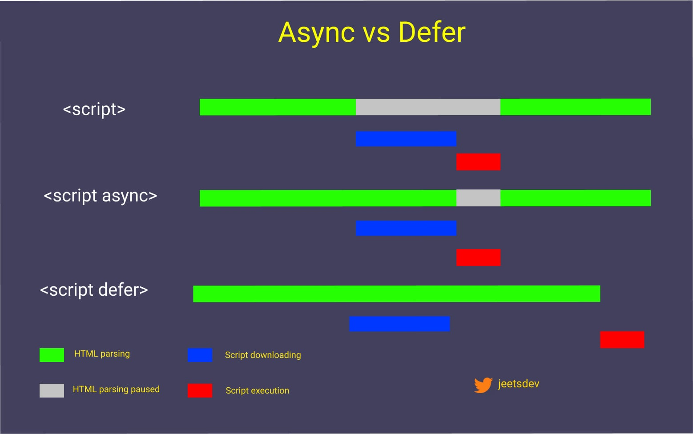

## SEO(搜索引擎优化)

SEO(Search Engine Optimization)是搜索引擎对网站的排名和收录的过程，通过对网站的页面内容、链接、关键字、标题、图片等进行优化，**提升网站在搜索引擎的排名**，从而提高网站的流量。

其中Next.js在SEO方面表现出色

- 黑帽SEO(非人手段提升SEO)：通常指的是使用违反搜索引擎规则的技术手段来提升网站排名。**(关键词滥用)**
- 白帽SEO：遵循搜索引擎的规则进行优化，注重网站内容的质量，通过提高网站的用户体验来赢得更好的排名。

## TDK(Title Description Keywords)

Title Description Keywords

Next.js支持自定义这些TDK元素，可以通过使用组件来设置每个页面的标题、描述和关键词，从而更好地进行SEO优化。

## SSG SPA SSR

SSG(Static Site Generator)是一种Web应用程序的开发模式，服务器端生成**静态**HTML页面，浏览器直接加载静态页面，实现页面的快速加载。代表有：Vitepress AStro 主要用于 官网 营销页 博客 技术文档

SPA(Single Page Application)是一种Web应用程序的开发模式，整个页面由一个HTML文件和JavaScript脚本构成，通过JavaScript**动态**更新页面内容，实现用户与应用的交互。

SSR(Server-Side Rendering) = SPA + SSG

## 事件代理

事件代理（Event Delegation）是一种在JavaScript中处理多个事件监听器的方法。它是一种利用**事件冒泡机制**的编程模式，将事件监听器添加到父元素上，而不是直接添加到每个子元素上，通过判断事件的目标元素来执行相应的操作。其核心原理是：**基于 DOM 事件流的冒泡阶段**：当子元素触发事件时，事件会向上冒泡到父元素。

## 回流与重绘

回流（Reflow）：改变布局 → 重新计算 → 重新渲染
重绘（Repaint）：改变样式 → 重新绘制

**回流必定引起重绘，但重绘不一定引起回流**

## defer 和 async



## `import A from 'C'`和 `import { B } from 'C'` 有什么区别?

`import A from 'C'` 导入的是模块 C 的默认导出（export default），A 是你给它起的任意名字。

`import { B } from 'C'` 导入的是模块 C 的具名导出（export），B 必须和导出时的名字一致。

```javascript
// C.js
export default function foo() {} // 默认导出
export function bar() {} // 具名导出

// 导入侧
import Whatever from "C"; // Whatever === foo，名字随便取
import { bar } from "C"; // 必须叫 bar，除非用 as 重命名：import { bar as baz } from 'C'
```

- 一个模块只能有一个 `export default`，但可以有多个 `export`。
- 默认导出本质上是一个名为 `default` 的具名导出，所以 `import { default as A } from 'C'` 等价于 `import A from 'C'`。
- 两者可以混用：`import A, { B } from 'C'`。

## 字符串 数组 对象 方法总结

### 一、字符串方法（String）

> **特点：字符串是不可变的**
> 也就是说：字符串方法基本都会返回**新字符串**，**不会修改原字符串**。

1. 常用字符串方法

| 方法                     | 作用                 | 示例                           | 返回值          |
| ------------------------ | -------------------- | ------------------------------ | --------------- |
| `trim()`                 | 去掉两端空白         | `"  hi  ".trim()`              | `"hi"`          |
| `trimStart()`            | 去掉开头空白         | `"  hi".trimStart()`           | `"hi"`          |
| `trimEnd()`              | 去掉结尾空白         | `"hi  ".trimEnd()`             | `"hi"`          |
| `toUpperCase()`          | 转大写               | `"abc".toUpperCase()`          | `"ABC"`         |
| `toLowerCase()`          | 转小写               | `"ABC".toLowerCase()`          | `"abc"`         |
| `includes()`             | 是否包含某字符串     | `"hello".includes("ell")`      | `true`          |
| `startsWith()`           | 是否以某字符串开头   | `"hello".startsWith("he")`     | `true`          |
| `endsWith()`             | 是否以某字符串结尾   | `"hello".endsWith("lo")`       | `true`          |
| `indexOf()`              | 查找第一次出现位置   | `"hello".indexOf("l")`         | `2`             |
| `lastIndexOf()`          | 查找最后一次出现位置 | `"hello".lastIndexOf("l")`     | `3`             |
| `slice(start, end?)`     | 截取字符串           | `"hello".slice(1,4)`           | `"ell"`         |
| `substring(start, end?)` | 截取字符串           | `"hello".substring(1,4)`       | `"ell"`         |
| `replace()`              | 替换内容             | `"a-b-c".replace("-", "_")`    | `"a_b-c"`       |
| `replaceAll()`           | 替换所有匹配项       | `"a-b-c".replaceAll("-", "_")` | `"a_b_c"`       |
| `split()`                | 分割成数组           | `"a,b,c".split(",")`           | `["a","b","c"]` |
| `repeat()`               | 重复字符串           | `"ha".repeat(3)`               | `"hahaha"`      |
| `charAt()`               | 取某个位置字符       | `"hello".charAt(1)`            | `"e"`           |
| `at()`                   | 按索引取字符，可负数 | `"hello".at(-1)`               | `"o"`           |
| `padStart()`             | 开头补全             | `"5".padStart(3,"0")`          | `"005"`         |
| `padEnd()`               | 结尾补全             | `"5".padEnd(3,"0")`            | `"500"`         |

---

2. 常见补充

::: tip `slice()` 和 `substring()` 的区别

```ts
const str = "hello";

str.slice(-2); // "lo"
str.substring(-2); // "hello" 负数会按 0 处理
```

:::

`replace()` 默认只替换第一个

```ts
"a-a-a".replace("a", "b"); // "b-a-a"
"a-a-a".replaceAll("a", "b"); // "b-b-b"
```

`split()`

```ts
const str = "Tom,18,男";
const arr = str.split(","); // ["Tom", "18", "男"]
```

---

3. 字符串最常用的几个

- `trim()`
- `includes()`
- `slice()`
- `replace()`
- `split()`
- `toUpperCase()`
- `toLowerCase()`
- `startsWith()`
- `endsWith()`

---

### 二、数组方法（Array）

> **特点：数组方法很多**
> 其中最重要的是区分：
> **哪些会修改原数组，哪些不会修改原数组**

---

1. 会修改原数组的方法

| 方法           | 作用             | 示例                      |
| -------------- | ---------------- | ------------------------- |
| `push()`       | 尾部添加         | `arr.push(4)`             |
| `pop()`        | 删除最后一个     | `arr.pop()`               |
| `unshift()`    | 头部添加         | `arr.unshift(0)`          |
| `shift()`      | 删除第一个       | `arr.shift()`             |
| `splice()`     | 任意位置增删改   | `arr.splice(1, 2)`        |
| `sort()`       | 排序             | `arr.sort((a,b)=>a-b)`    |
| `reverse()`    | 反转             | `arr.reverse()`           |
| `fill()`       | 填充数组         | `arr.fill(0)`             |
| `copyWithin()` | 复制数组内部元素 | `arr.copyWithin(1, 0, 2)` |

示例

```ts
const arr = [1, 2, 3];

arr.push(4); // [1,2,3,4]
arr.pop(); // 删除最后一个
arr.unshift(0); // [0,1,2,3]
arr.shift(); // 删除第一个
```

`splice()` 非常重要

```ts
const arr = [1, 2, 3, 4];

arr.splice(1, 2); // 删除索引1开始的2个元素
arr.splice(1, 0, 99); // 在索引1插入99
arr.splice(1, 1, 88); // 替换
```

---

2. 不会修改原数组的方法

| 方法              | 作用                     | 示例                             |
| ----------------- | ------------------------ | -------------------------------- |
| `slice()`         | 截取数组                 | `arr.slice(1,3)`                 |
| `concat()`        | 拼接数组                 | `arr.concat([4,5])`              |
| `includes()`      | 是否包含元素             | `arr.includes(2)`                |
| `indexOf()`       | 查找第一次出现位置       | `arr.indexOf(2)`                 |
| `lastIndexOf()`   | 查找最后一次出现位置     | `arr.lastIndexOf(2)`             |
| `find()`          | 找到第一个满足条件的元素 | `arr.find(x=>x>2)`               |
| `findIndex()`     | 找到第一个满足条件的索引 | `arr.findIndex(x=>x>2)`          |
| `findLast()`      | 从后往前找元素           | `arr.findLast(x=>x>2)`           |
| `findLastIndex()` | 从后往前找索引           | `arr.findLastIndex(x=>x>2)`      |
| `forEach()`       | 遍历                     | `arr.forEach(x=>console.log(x))` |
| `map()`           | 映射，返回新数组         | `arr.map(x=>x*2)`                |
| `filter()`        | 过滤，返回新数组         | `arr.filter(x=>x>2)`             |
| `reduce()`        | 累加/归并                | `arr.reduce((a,b)=>a+b,0)`       |
| `reduceRight()`   | 从右往左归并             | `arr.reduceRight(...)`           |
| `some()`          | 是否至少一个满足         | `arr.some(x=>x>2)`               |
| `every()`         | 是否全部满足             | `arr.every(x=>x>0)`              |
| `join()`          | 数组转字符串             | `arr.join("-")`                  |
| `flat()`          | 扁平化                   | `[1,[2,[3]]].flat(2)`            |
| `flatMap()`       | 先 map 再 flat(1)        | `arr.flatMap(...)`               |
| `at()`            | 按索引取值，可负数       | `arr.at(-1)`                     |
| `toString()`      | 转字符串                 | `arr.toString()`                 |

---

3. 常用数组方法分类记忆

增删

- `push()`
- `pop()`
- `shift()`
- `unshift()`
- `splice()`

截取 / 拼接

- `slice()`
- `concat()`

查找

- `includes()`
- `indexOf()`
- `find()`
- `findIndex()`

遍历 / 处理

- `forEach()`
- `map()`
- `filter()`
- `reduce()`

条件判断

- `some()`
- `every()`

排序 / 反转

- `sort()`
- `reverse()`

转字符串

- `join()`

扁平化

- `flat()`
- `flatMap()`

---

4. 现代数组新方法（不改原数组）

这些是比较新的写法：

| 方法                 | 作用                         |
| -------------------- | ---------------------------- |
| `toSorted()`         | 排序但不改原数组             |
| `toReversed()`       | 反转但不改原数组             |
| `toSpliced()`        | `splice` 的非破坏版          |
| `with(index, value)` | 替换某个位置元素，返回新数组 |

示例

```ts
const arr = [3, 1, 2];

const a = arr.toSorted((x, y) => x - y); // [1,2,3]
const b = arr.toReversed(); // [2,1,3]
```

---

5. 数组最常用的几个

建议优先掌握：

- `push() / pop()`
- `shift() / unshift()`
- `splice() / slice()`
- `map()`
- `filter()`
- `reduce()`
- `find() / findIndex()`
- `includes()`
- `some() / every()`
- `sort()`
- `join()`

---

### 三、对象方法（Object）

> **对象和数组不一样**
> 对象常用的不是“实例方法”，而是 `Object.xxx()` 这样的**静态方法**。

---

1. 常用对象方法

| 方法                                | 作用               | 示例                                     |
| ----------------------------------- | ------------------ | ---------------------------------------- |
| `Object.keys(obj)`                  | 获取所有键         | `Object.keys(user)`                      |
| `Object.values(obj)`                | 获取所有值         | `Object.values(user)`                    |
| `Object.entries(obj)`               | 获取键值对数组     | `Object.entries(user)`                   |
| `Object.fromEntries(arr)`           | 键值对数组转对象   | `Object.fromEntries([["a",1]])`          |
| `Object.assign(target, ...sources)` | 合并对象           | `Object.assign({}, a, b)`                |
| `Object.hasOwn(obj, key)`           | 判断是否有自身属性 | `Object.hasOwn(user, "name")`            |
| `Object.freeze(obj)`                | 冻结对象           | `Object.freeze(user)`                    |
| `Object.seal(obj)`                  | 密封对象           | `Object.seal(user)`                      |
| `Object.preventExtensions(obj)`     | 禁止新增属性       | `Object.preventExtensions(user)`         |
| `Object.defineProperty()`           | 定义属性           | `Object.defineProperty(obj, "x", {...})` |
| `Object.defineProperties()`         | 批量定义属性       | `Object.defineProperties(obj, {...})`    |
| `Object.create(proto)`              | 指定原型创建对象   | `Object.create(proto)`                   |
| `Object.getPrototypeOf(obj)`        | 获取原型           | `Object.getPrototypeOf(obj)`             |
| `Object.setPrototypeOf(obj, proto)` | 设置原型           | `Object.setPrototypeOf(obj, proto)`      |
| `Object.is(a, b)`                   | 更严格地比较两个值 | `Object.is(NaN, NaN)`                    |

---

2. 最常用的对象方法示例

`Object.keys / values / entries`

```ts
const user = { name: "Tom", age: 18 };

Object.keys(user); // ["name", "age"]
Object.values(user); // ["Tom", 18]
Object.entries(user); // [["name", "Tom"], ["age", 18]]
```

`Object.fromEntries`

```ts
const arr = [
  ["name", "Tom"],
  ["age", 18],
];
const obj = Object.fromEntries(arr);
// { name: "Tom", age: 18 }
```

`Object.assign`

```ts
const a = { x: 1 };
const b = { y: 2 };

const c = Object.assign({}, a, b);
// { x: 1, y: 2 }
```

也常用展开运算符：

```ts
const c = { ...a, ...b };
```

`Object.hasOwn`

```ts
const user = { name: "Tom" };

Object.hasOwn(user, "name"); // true
```

---

3. 对象常用操作（不是方法，但很常见）

| 写法             | 作用             |
| ---------------- | ---------------- |
| `obj.name`       | 访问属性         |
| `obj["name"]`    | 按键访问属性     |
| `obj.age = 18`   | 新增/修改属性    |
| `delete obj.age` | 删除属性         |
| `"name" in obj`  | 判断属性是否存在 |
| `for...in`       | 遍历对象         |
| `{ ...obj }`     | 浅拷贝对象       |

示例

```ts
const obj = { name: "Tom", age: 18 };

console.log(obj.name); // Tom
console.log("name" in obj); // true

delete obj.age;
```

---

4. 对象最常用的几个

建议优先掌握：

- `Object.keys()`
- `Object.values()`
- `Object.entries()`
- `Object.fromEntries()`
- `Object.assign()`
- `Object.hasOwn()`
- `Object.freeze()`

---

### 四、三类方法的重点区别

1. 字符串

- **基本不改原字符串**
- 常做：截取、查找、替换、分割、去空格

2. 数组

- 方法最多
- 一定要区分：
  - **改原数组**
  - **不改原数组**

3. 对象

- 常用 `Object.xxx()` 静态方法
- 常做：取键值、合并、判断属性、冻结对象

---

### 五、最值得背的速查版

字符串最常用

```ts
trim();
toUpperCase();
toLowerCase();
includes();
startsWith();
endsWith();
indexOf();
slice();
replace();
split();
repeat();
at();
```

数组最常用

```ts
push();
pop();
shift();
unshift();
splice();
slice();
concat();
includes();
find();
findIndex();
forEach();
map();
filter();
reduce();
some();
every();
sort();
reverse();
join();
flat();
at();
```

对象最常用

```ts
Object.keys();
Object.values();
Object.entries();
Object.fromEntries();
Object.assign();
Object.hasOwn();
Object.freeze();
Object.seal();
Object.create();
Object.defineProperty();
```

---
